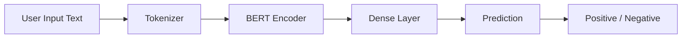
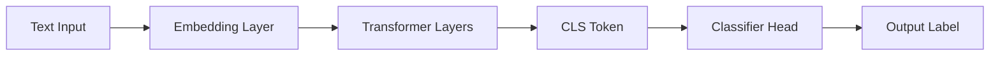
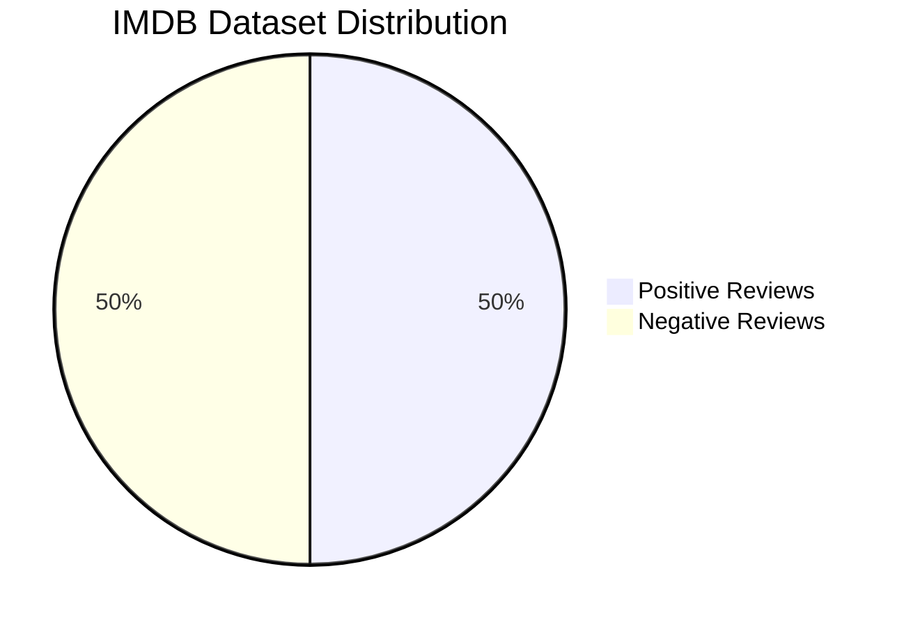
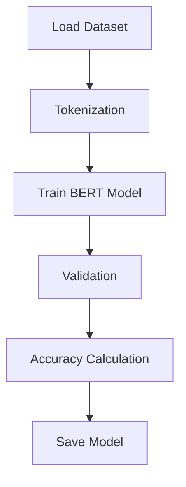
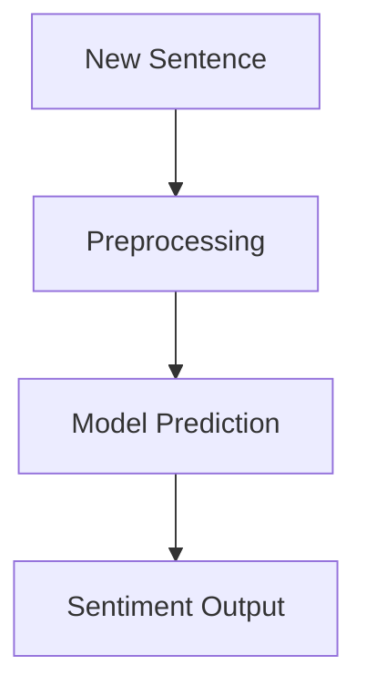

# BERT-Based-Sentiment-Analysis-using-NLP
This project implements a sentiment analysis system using the BERT model from HuggingFace Transformers. It is trained on the IMDB dataset to classify movie reviews as positive or negative. The system uses tokenization, fine-tuning of a pre-trained transformer model, and evaluation using accuracy metrics. 

# 📊 BERT Sentiment Analysis

> AI model that understands human language and predicts sentiment using BERT

---

## ⚡ Quick Stats

* 🧠 Model: BERT (bert-base-uncased)
* 📂 Dataset: IMDB (50K reviews)
* 🎯 Task: Binary Sentiment Classification
* 📈 Output: Positive / Negative

---

## 🔄 System Pipeline



---

## 🧠 Model Architecture (Simplified)



---

## 📊 Data Insight (Sample Distribution)



---

## 📉 Training Workflow



---

## 🚀 Inference Flow



---

## 🧪 Example Predictions

```python
classifier("This movie was absolutely amazing!")
# Positive

classifier("I regret watching this movie.")
# Negative
```

---

## 📁 Project Structure

```
BERT-Based-Sentiment-Analysis
 ┣ bert_nlp.ipynb
 ┣ README.md
```

---

## 👩‍💻 Contributors

* Tazub
* muskan

---

## 🌟 Future Enhancements

* 📊 Interactive Streamlit Dashboard
* 📈 Visualization of training metrics
* 🌐 Model deployment (web app)

---

## 💡 Key Idea

This project shows how **transformer-based models like BERT** can understand context and meaning in text, enabling accurate sentiment classification.

---

⭐ If you found this useful, give it a star!
