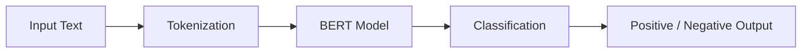
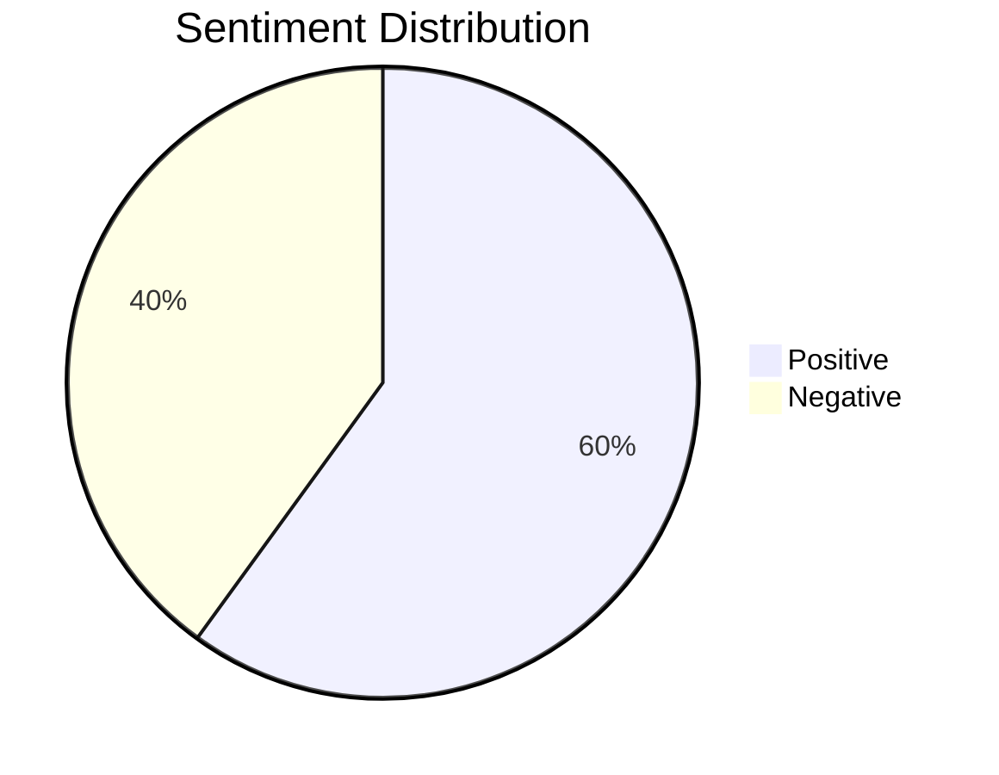
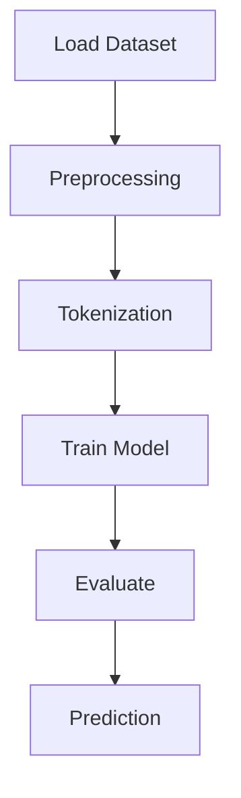

# BERT-Based-Sentiment-Analysis-using-NLP
This project implements a sentiment analysis system using the BERT model from HuggingFace Transformers. It is trained on the IMDB dataset to classify movie reviews as positive or negative. The system uses tokenization, fine-tuning of a pre-trained transformer model, and evaluation using accuracy metrics. 
# 📊 BERT Sentiment Analysis Dashboard

AI-powered sentiment classification using BERT

---

## 📈 Model Overview

* Model: BERT (bert-base-uncased)
* Task: Sentiment Analysis
* Dataset: IMDB
* Output: Positive / Negative

---

## 🔄 Workflow Pipeline



---

## 📊 Sentiment Distribution



---

## 📉 Training Flow



---

## 🚀 Example

```python
classifier("This movie was amazing!")
# Positive

classifier("Worst movie ever.")
# Negative
```

---

## 📂 Project Structure

```
BERT-Based-Sentiment-Analysis
 ┣ bert_nlp.ipynb
 ┗ README.md
```

---

## 👩‍💻 Contributors

* Muskan
* Your Friend

---

## 🌟 Future Work

* Add Streamlit dashboard
* Improve accuracy
* Deploy model

---

⭐ Star this repo if you like it
